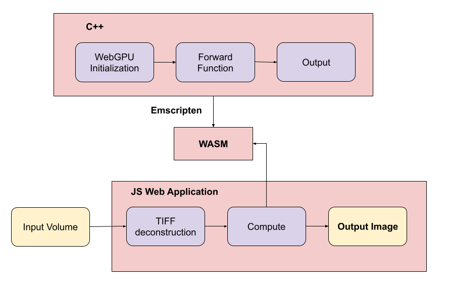
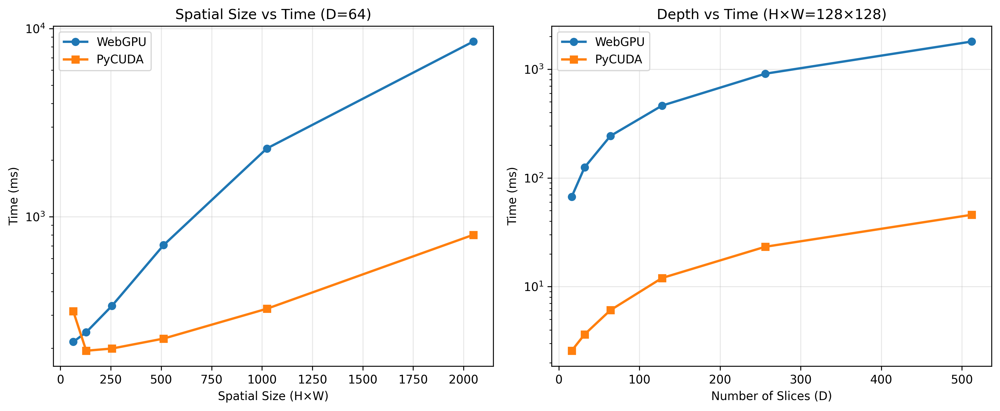

# WebGPU SSNP Model

A WebGPU-based reimplementation of **High-Fidelity Intensity Diffraction Tomography with a Non-Paraxial Multiple-Scattering Model (SSNP-IDT)**, originally introduced by Jiabei Zhu, Hao Wang, and Lei Tian [[paper]](https://opg.optica.org/oe/fulltext.cfm?uri=oe-30-18-32808&id=495495) and implemented in PyCUDA [[original code]](https://github.com/bu-cisl/SSNP-IDT).

This project ports the SSNP-IDT algorithm to the browser using **WebGPU** via C++ and **Emscripten**, making it device-agnostic and fully browser-compatible.

**Live demo**: [https://andrewx-bu.github.io/wgpu-ssnp/](https://andrewx-bu.github.io/wgpu-ssnp/)

## Table of Contents
- [Motivation](#motivation)
- [Features](#features)
- [Physics Background](#physics-background)
- [Demo](#demo)
- [Architecture Overview](#architecture-overview)
- [Evaluation](#evaluation)
- [References](#references)
- [Acknowledgments](#acknowledgments)

## Motivation

Recent advances in computational imaging have produced powerful models, but most remain difficult to deploy due to hardware dependencies, proprietary drivers, and complex software stacks.

SSNP is one such model: a waved-based physics model for diffraction tomography, which is non-paraxial and models multiple scattering. The original implementation is written in PyCUDA and optimized for NVIDIA GPUs, requiring a Python/CUDA environment and compatible hardware.

This project is a new implemention of SSNP in WebGPU and C++, compiled to WebAssembly via Emscripten. It runs entirely in the browser, with no installation or platform constraints, making the model broadly accessible while retaining competitive performance.

## Features

- **Device-Agnostic**: Compatible with various GPU and compute backends, not tied to a specific platform or vendor  
- **Browser-Native Execution**: Runs entirely in-browser via WebGPU with no installation required  
- **Interactive Visualization**: Displays reconstructed output in real time within a browser interface  
- **User-Configurable Inputs**: Adjustable parameters include numerical aperture, resolution, refractive index, and illumination mode  
- **Model Fidelity**: Faithfully reimplements the original SSNP-IDT architecture with comparable runtime performance  
- **Volumetric Input**: Accepts **.tiff** volume datasets directly through the web interface  

## Physics Background

Intensity Diffraction Tomography (IDT) is a computational imaging technique that reconstructs the 3D refractive index of a sample by analyzing how light scatters through it under varying illumination angles. Traditional IDT methods often rely on single-scattering (Born) approximations and paraxial assumptions, which limit accuracy in high-resolution or strongly scattering regimes.

SSNP-IDT addresses these limitations by incorporating a **non-paraxial multiple-scattering model**. The forward model is fully physics-based and differentiable, enabling iterative gradient-based inversion from intensity-only measurements. **This implementation omits the gradient computation for prototyping focusing on the forward pass only.**

This approach allows for high-fidelity 3D reconstruction of complex, thick samples using a compact, single-shot data acquisition setup.

## Demo

To test the model in the browser, visit the live demo:  
[https://andrewx-bu.github.io/wgpu-ssnp/](https://andrewx-bu.github.io/wgpu-ssnp/)

1. Upload a volumetric **.tiff** using the file input panel
2. Adjust key imaging parameters such as:
   - Numerical aperture  
   - Resolution  
   - Refractive index  
   - Illumination mode  
3. Run the model to generate a reconstruction  

A sample input file is provided: [**input.tiff**](https://github.com/andrewx-bu/wgpu-ssnp/blob/main/input.tiff)  
This volume is 128×128×50 and contains a quarter-radius sphere with voxel values set to **0.01** inside and **0** outside.

**Sample Input (Volume Rendering):**  

**Expected Output (With Default Settings):**

Feel free to experiment with different parameters or upload custom volumetric inputs!

## Architecture Overview

The system consists of a WebAssembly-compiled C++ backend and a lightweight browser-based frontend. All computation is executed on the client-side GPU using WebGPU, with no server-side processing or platform-specific dependencies.

### System Diagram

### Backend 

- Initializes the WebGPU context and handles device selection  
- Compiles and orchestrates modular WebGPU compute shaders representing each stage of the SSNP algorithm  
- Uses GPU buffers to pass data between shader stages, minimizing I/O overhead  
- Dynamically configures workgroup sizes and dispatch strategy based on input volume and hardware  
- Compiled to WebAssembly (WASM) using Emscripten for browser integration  
- Includes a standalone WebGPU-based DFT module ([wgpu-dft](https://github.com/rayan-syed/wgpu-dft)), developed for this project and extracted as a reusable component

### Frontend

- Provides a browser interface for uploading **.tiff** volume data  
- Carefully decodes the volume data into a **.bin** file using **UTIF.js** for the C++ executable to use as input
- Coordinates execution of the backend pipeline and retrieves output data  
- Displays reconstructed results interactively using standard browser rendering techniques  
- Exposes controls for key imaging parameters such as numerical aperture, resolution, and refractive index  

## Evaluation
We benchmarked this WebGPU implementation of the SSNP model against the original model written in PyCUDA with respect to accuracy and performance.

### Accuracy
We determined the WebGPU implementation of the model to be accurate within **1e-4** relative tolerance for sufficiently large inputs (ex. 2048x2048x256 volume). With an extremely large input (ex. 1024x2048x2048 volume), the accuracy is no longer within this threshold, but still remains within a **1e-3** relative tolerance threshold by a huge margin. We believe this is sufficiently accurate.

### Performance

We evaluated the performance of our WebGPU implementation of the model against the original with respect to the spatial size (HxW) changing and the depth (D) changing. 

In the scenario in which only spatial size changes, WebGPU remains consistently slower than PyCUDA.

In the scenario in which depth changes, WebGPU becomes much slower than PyCUDA as depth increases. This makes sense since for every extra slice in the volume, more FFT calls are made. Since WebGPU utilizes a naive DFT at the moment instead of an FFT, the slowdown can confidently be attributed to that.

Although not plotted, with extremely small inputs, the WebGPU implementation was much faster than PyCUDA. We strongly believe that with an FFT implementation instead of a DFT, the performance will become as good if not better than that of PyCUDA for large inputs as well. This is a change we hope to make in the future.

## References

- Jiabei Zhu, Hao Wang, and Lei Tian.  
  *High-Fidelity Intensity Diffraction Tomography with a Non-Paraxial Multiple-Scattering Model*.  
  Optics Express, Vol. 30, No. 18, pp. 32808–32821 (2022).  
  [Paper](https://opg.optica.org/oe/fulltext.cfm?uri=oe-30-18-32808&id=495495) | [arXiv](https://arxiv.org/abs/2207.06532)

- Original PyCUDA implementation of SSNP-IDT:  
  [https://github.com/bu-cisl/SSNP-IDT](https://github.com/bu-cisl/SSNP-IDT)

- WebGPU-Cpp: C++ abstraction layer for WebGPU  
  [https://github.com/eliemichel/WebGPU-Cpp](https://github.com/eliemichel/WebGPU-Cpp)

## Acknowledgments

This work was conducted as part of the Computational Imaging Systems Lab (CISL) at Boston University.

We thank Jiabei Zhu, Hao Wang, and Lei Tian for developing the original SSNP-IDT model and releasing the PyCUDA implementation.  
Special thanks to [Mitchell Gilmore](https://github.com/mitch-gilmore) and [Jeffrey Alido](https://github.com/jeffreyalido) for their support and feedback throughout the project.  
We also acknowledge [Elie Michel](https://github.com/eliemichel) for the WebGPU-Cpp library, which served as the foundation for the C++ backend, and [Photopea](https://github.com/photopea/UTIF.js) for the UTIF.js library used for TIFF decoding.
