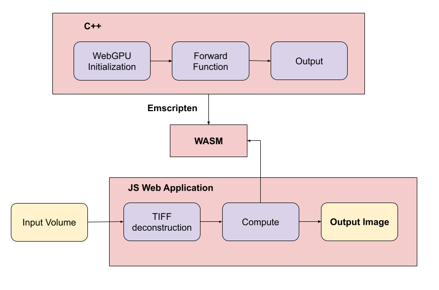

# WebGPU IDT Framework

A WebGPU-based framework for Intensity Diffraction Tomography (IDT), supporting multiple physics-based forward models and experimental 3D reconstruction (e.g., [SSNP-IDT](https://opg.optica.org/oe/fulltext.cfm?uri=oe-30-18-32808&id=495495)).

The project implements Born approximation, Beam Propagation Method (BPM), and Split-Step Non-Paraxial (SSNP) forward propagation in C++/WebGPU, with browser deployment through Emscripten/WebAssembly. The goal is to make computational imaging models portable, hardware-agnostic, and accessible without requiring CUDA or server-side execution.

**Report**: [WebGPU-IDT Report](WebGPU-IDT-Report.pdf)  
**Live demo**: [WebGPU-IDT Arena](https://bu-cisl.github.io/wgpu-idt/)

## Motivation

Recent advances in computational imaging have produced powerful models, but most remain difficult to deploy due to hardware dependencies, proprietary drivers, and complex software stacks.

SSNP is one such model: a waved-based physics model for diffraction tomography, which is non-paraxial and models multiple scattering. The original implementation is written in PyCUDA and optimized for NVIDIA GPUs, requiring a Python/CUDA environment and compatible hardware.

This project explores WebGPU as a portable backend for IDT. We support Born approximation for weak scattering, BPM for paraxial propagation, and SSNP for higher-fidelity multiple scattering. 

The same backend also supports experimental inverse reconstruction (currently implemented for SSNP only), allowing the system to be used for both simulation and reconstruction research.

## Features

- **Device-Agnostic**: Compatible with various GPU and compute backends, not tied to a specific platform or vendor  
- **Browser-Native Execution**: Runs entirely in-browser via WebGPU with no installation required  
- **Interactive Visualization**: Displays simulated outputs in real time within a browser interface
- **Downloadable Results**: Provides option to export simulated output tensors as numpy files
- **User-Configurable Inputs**: Adjustable parameters include numerical aperture, resolution, refractive index, and illumination mode  
- **Volumetric Input**: Accepts **.tiff** volume datasets directly through the web interface  

## Demo

To test the model in the browser, visit the live demo:  
[https://bu-cisl.github.io/wgpu-idt/](https://bu-cisl.github.io/wgpu-idt/)

 Note: The current demo focuses only on forward simulation. Full reconstruction is supported in the internal pipeline and is not exposed in the web interface due to computational cost and the difficulty of supporting an interactive reconstruction workflow in a browser UI. 

1. Upload a volumetric **.tiff** using the file input panel
2. Adjust key imaging parameters such as:
   - Numerical aperture  
   - Resolution  
   - Refractive index  
   - Illumination mode  
3. Run the model to generate a simulated measurement  
4. Download the output tensor as a numpy file (optional)

A sample input file is provided: [**input.tiff**](https://github.com/bu-cisl/wgpu-idt/blob/main/input.tiff)  
This volume is 128×128×50 and contains a quarter-radius sphere with voxel values set to **0.01** inside and **0** outside.

**Sample Input (Volume Rendering):**  

**Expected Output (With Default Settings):**

Feel free to experiment with different parameters or upload custom volumetric inputs!

## Architecture Overview

The system consists of a WebAssembly-compiled C++ backend and a lightweight browser-based frontend. All computation is executed on the client-side GPU using WebGPU, with no server-side processing or platform-specific dependencies.

### System Diagram

### Backend 

- Initializes the WebGPU context and handles device selection  
- Compiles and orchestrates modular WebGPU compute shaders
- Uses GPU buffers to pass data between shader stages, minimizing I/O overhead  
- Dynamically configures workgroup sizes and dispatch strategy based on input volume and hardware  
- Compiled to WebAssembly (WASM) using Emscripten for browser integration  
- Includes a standalone WebGPU-based FFT module ([wgpu-fft](https://github.com/rayan-syed/wgpu-fft)), developed for this project and extracted as a reusable component

### Frontend

- Provides a browser interface for uploading **.tiff** volume data  
- Carefully decodes the volume data into a **.bin** file for the C++ executable to use as input
- Coordinates execution of the backend pipeline and retrieves output data  
- Displays simulated results interactively using standard browser rendering techniques  
- Exposes controls for key imaging parameters such as numerical aperture, resolution, and refractive index  

## Evaluation

We evaluate the framework in terms of forward model accuracy, performance, and reconstruction quality.

- **Accuracy**: All forward models (Born, BPM, SSNP) match PyTorch reference implementations within approximately \(1e^{-4}\) relative error for large inputs
- **Performance**: The WebGPU implementation exhibits similar scaling trends to PyCUDA but with higher runtime, primarily due to memory movement and execution overhead
- **Reconstruction**: The reconstruction pipeline successfully recovers spatial structure from synthetic measurements, though it tends to underestimate refractive index magnitude

For full experimental details, benchmarks, and analysis, please refer to our [report](WebGPU-IDT-Report.pdf).

## Acknowledgments

This work was conducted as part of the Computational Imaging Systems Lab (CISL) at Boston University.

We thank Jiabei Zhu, Hao Wang, and Lei Tian for developing the original SSNP-IDT model and releasing the PyCUDA implementation, which inspired this project.

Special thanks to [Mitchell Gilmore](https://github.com/mitch-gilmore) and [Jeffrey Alido](https://github.com/jeffreyalido) for their support and feedback throughout the project.  

We also acknowledge [Elie Michel](https://github.com/eliemichel) for the WebGPU-Cpp library, which served as the foundation for the C++ backend
